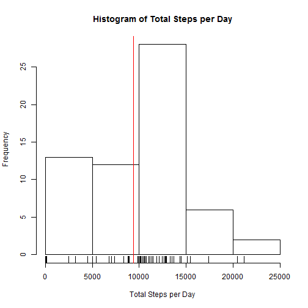
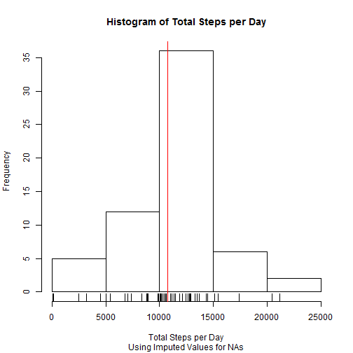

## Loading and preprocessing the data

```r
unzip("./activity.zip")
data <- read.csv("./activity.csv", colClasses=c("numeric","Date","numeric"))
```

```r
library(dplyr)
library(xtable)
library(lubridate)
library(lattice)
```


## What is mean total number of steps taken per day?

```r
data.group.date <- summarize(group_by(data, date),
                        sum = sum(steps, na.rm=TRUE),
                        mean = mean(steps, na.rm=TRUE),
                        median = median(steps, na.rm=TRUE))

hist(data.group.date$sum, xlab="Total Steps per Day", main="Histogram of Total Steps per Day")
rug(data.group.date$sum)
abline(v=mean(data.group.date$sum), col="red")
```

 


```r
mean.spd <- mean(data.group.date$sum)
median.spd <- median(data.group.date$sum)
```
The mean steps per day is: 9354.23

The median steps per day is: 1.0395 &times; 10<sup>4</sup>

## What is the average daily activity pattern?

```r
data.group.interval <- summarize(group_by(data,interval),
                        mean = mean(steps, na.rm=TRUE))

plot(mean ~ interval, data=data.group.interval, type="l")

max.interval <- data.group.interval$interval[which.max(data.group.interval$mean)]
abline(v=max.interval, col="red")
axis(1, at=835, col="red")
```

 

The interval with the higest mean is: 835

## Imputing missing values

```r
# use interval mean to replace NA intervals for steps variable
missing.rows <- sum(is.na(data))
data.imputed <- full_join(data, data.group.interval, "interval")
data.imputed$steps[is.na(data.imputed$steps)] <- data.imputed$mean[is.na(data.imputed$steps)]
data.imputed <- select(data.imputed, -mean)

data.imputed.group.date <- summarize(group_by(data.imputed, date),
                        sum = sum(steps, na.rm=TRUE),
                        mean = mean(steps, na.rm=TRUE),
                        median = median(steps, na.rm=TRUE))

hist(data.imputed.group.date$sum, xlab="Total Steps per Day", main="Histogram of Total Steps per Day", sub="Using Imputed Values for NAs")
rug(data.imputed.group.date$sum)
abline(v=mean(data.imputed.group.date$sum), col="red")
```

 


```r
mean.imputed.spd <- mean(data.imputed.group.date$sum)
median.imputed.spd <- median(data.imputed.group.date$sum)
```
The mean steps per day using imputed values for NAs is: 1.076619 &times; 10<sup>4</sup>

The median steps per day using imputed values for NAs is: 1.0766189 &times; 10<sup>4</sup>

The difference between the original mean and the imputed mean is: -1411.96

The difference between the original median and the imputed median is: -371.19

In this case, the imputed mean and median are larger than the originals.

## Are there differences in activity patterns between weekdays and weekends?

```r
data.imputed <- mutate(data.imputed,
                       w=weekdays(date),
                       d=wday(date),
                       day=ifelse(wday(date) %in% c(1,7),
                                  "weekend","weekday"))

data.imputed.group.wday <- summarize(group_by(data.imputed, day, interval),
          mean=mean(steps)                     )
xyplot(mean ~ interval | day, data=data.imputed.group.wday, type="l")
```

 

Weekdays shows a large spike of activity early in the day while weekends shows a more steady rate of activity throughout the day. 
